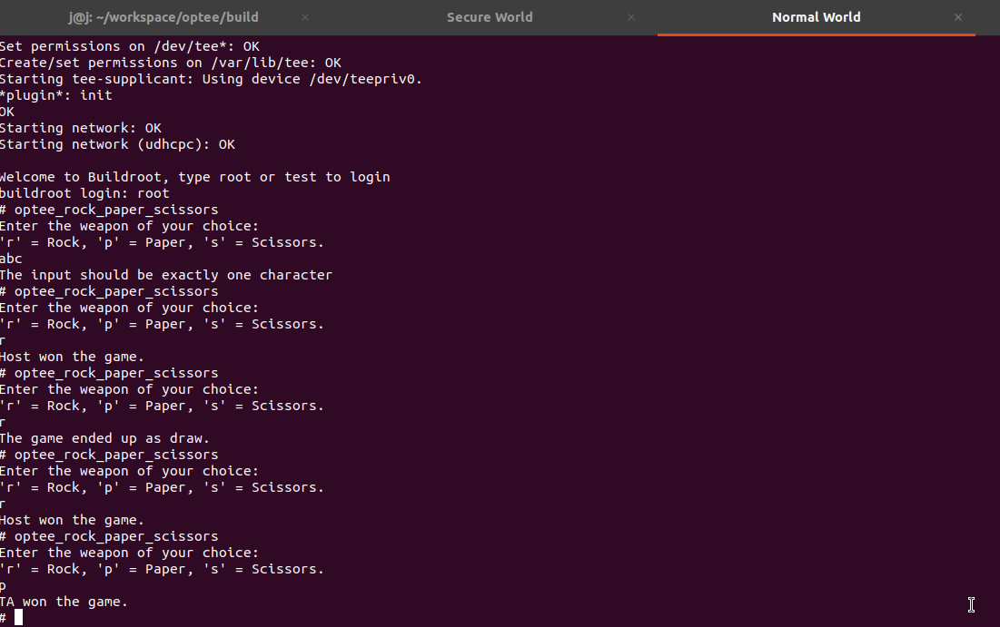
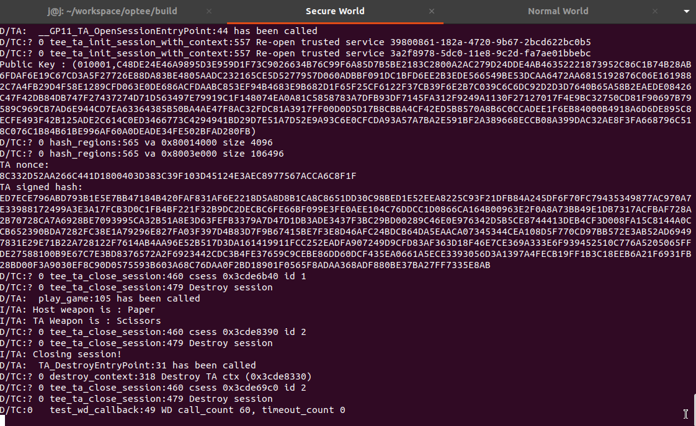

# OPTEE Rock-Paper-Scissors

Implementation of a rock-paper-scissor application, leveraging the Arm TrustZone mechanism with OP-TEE.
The application consists of the host application and the trusted application. 

## Task 1

To build and use OP-TEE an Ubuntu 20.04 LTS VM was used as suggested.

First, the prerequisites for the specified OS were installed as described in the 
respective page: https://optee.readthedocs.io/en/latest/building/prerequisites.html. 

Then the link from the task description (https://optee.readthedocs.io/en/latest/building/devices/qemu.html#qemu-v8)
was used to build and run OP-TEE. 
One small modification that was required, during the build, was to pass a configuration flag
that would enable the Pseudo-TA Attestation module in the OP-TEE kernel required for the Task 3, 
which is described below. This configuration is refered in the config.mk (https://github.com/OP-TEE/optee_os/blob/master/mk/config.mk#L673).

Specifically the `make run` command was modified to:

```sh
make CFG_ATTESTATION_PTA=y run
```

Optionally, more threads can be used to speed up the compilation:

```sh
make -j$(nproc) CFG_ATTESTATION_PTA=y run
```

Once this command finishes, 2 additional consoles (for host and for TA) are spawned.
Then the instructions found in the documentation can be 
used (https://optee.readthedocs.io/en/latest/building/devices/qemu.html#qemu-v7).

## Task 2

For the task 2, the host application is located in `host/` directory and the ta application in 
the `ta/` directory. The structure is similar to the `optee_examples` repository (https://github.com/linaro-swg/optee_examples/tree/master) that was used as reference. 

### High level design

The host upon execution reads a value from the stdin. This value is parsed into a "weapon", 
(rock, paper or scissor). This value is passed to the respective TA function that simulates
the game. TA uses pseudo-random function rand() to also select a weapon, 
calculate the winner and send the results back to Host.
Then Host prints the results. Values are being transmitted as enums defined in the TA header.

The application follows the structure of other examples and one very way to include it 
in the build and run it, is to add it to the `optee_examples/` directory, before running 

```sh
make -j$(nproc) CFG_ATTESTATION_PTA=y run
```

To run the application in the "normal world" console: 
```sh
optee_rock_paper_scissors
```

Example usage:



## Task 3

In OP-TEE there is a dedicated PTA(Pseudo-TA) kernel module responsible for Attestation functionality. PTAs are similar to TA applications but they work more like an interface.
More information here (https://optee.readthedocs.io/en/latest/architecture/trusted_applications.html#pseudo-trusted-applications). 

To enable attestation the core of OP-TEE has to be compiled with `CFG_ATTESTATION_PTA` as refered
in the previous sections.

The required attestation functionality for this task is implemented in a function `remote_attestation`.
The function is defined in `rock_paper_scissors_ta.c`. 
It is called every time another Trusted command is executed.
(First call might cause a slight delay since the key pair might need to be generated by OPTEE).
and it prints the Public RSA key in (exponent, Modulus) format, the randomized nonce, and the signed hash of the TA (64-byte hash followed by the RSA signature).

For reference PTA Attestation source files were used: 
- https://github.com/OP-TEE/optee_os/blob/master/lib/libutee/include/pta_attestation.h
- https://github.com/OP-TEE/optee_os/blob/master/core/pta/attestation.c

Along with regression tests for the pta attestation module: 
- https://github.com/OP-TEE/optee_test/blob/master/host/xtest/regression_1000.c#L2900-L2969

The secure world console should look like this:


